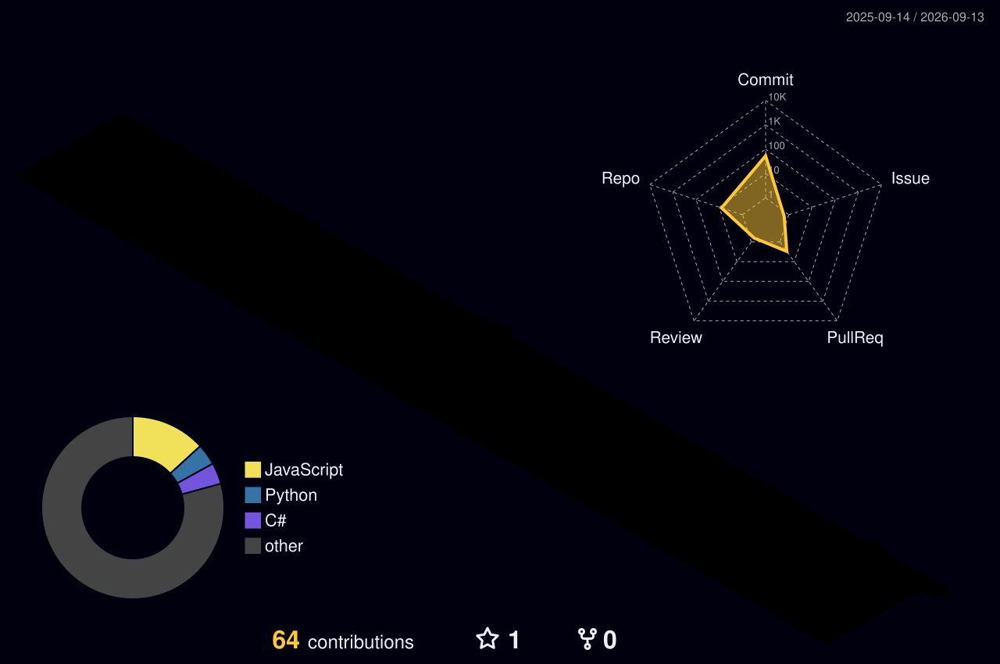

<h1 align="center">Hello 👋 I'm Lezgin Tekay</h1>
<h3 align="center">Full Stack Developer</h3>

  Software Developer focused on system architecture and full-stack engineering. Currently a third-year Management Information Systems student at Tarsus University. Proficient in building scalable, layered solutions using .NET Core, Vue.js, PostgreSQL, and Docker. Core experience includes developing SaaS architectures, system monitoring tools, and integrating cybersecurity principles into the software lifecycle.

---

  

  

---

<picture>
  <source media="(prefers-color-scheme: dark)" srcset="./profile-3d-contrib/profile-night-rainbow.svg">
  <source media="(prefers-color-scheme: light)" srcset="./profile-3d-contrib/profile-green.svg">
  
</picture>

<h4>For Contact : </h4>
 

 

